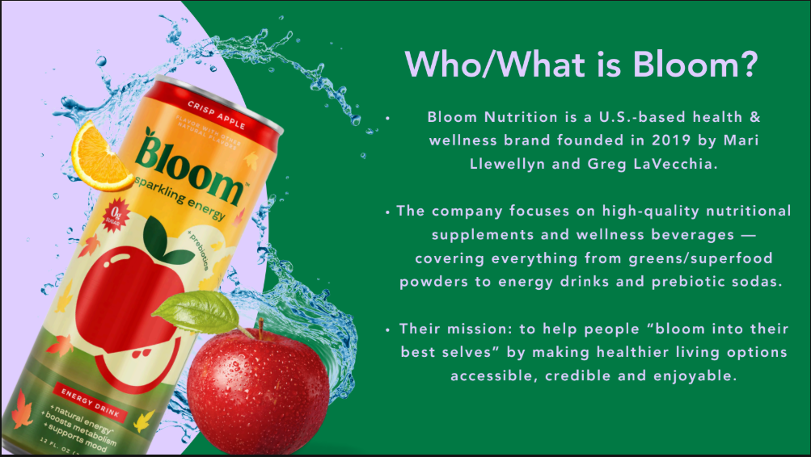
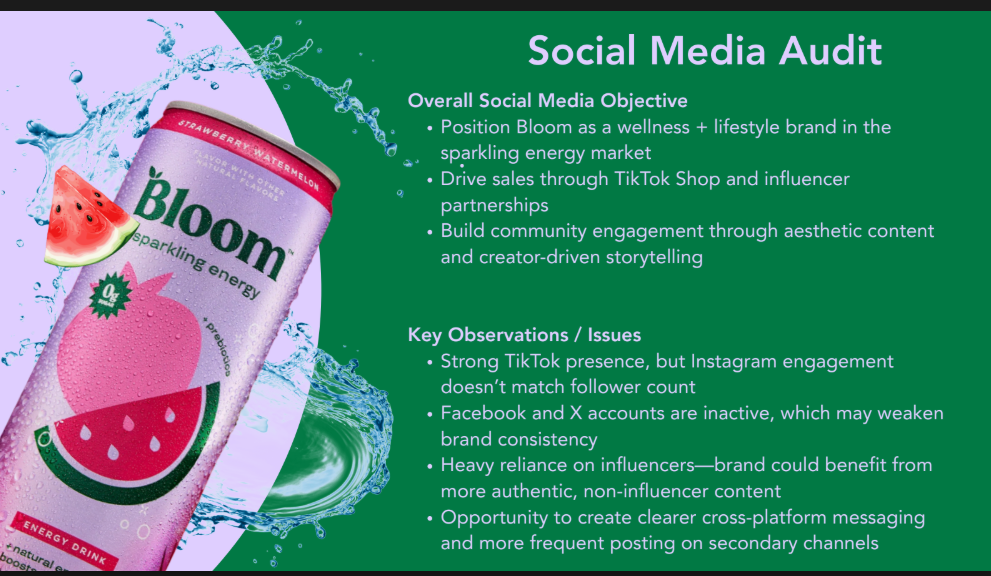
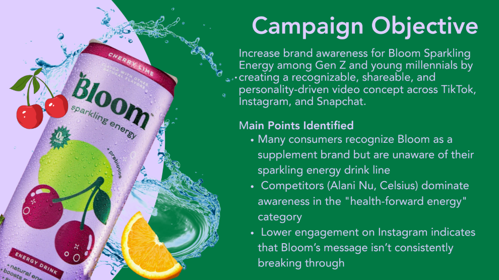
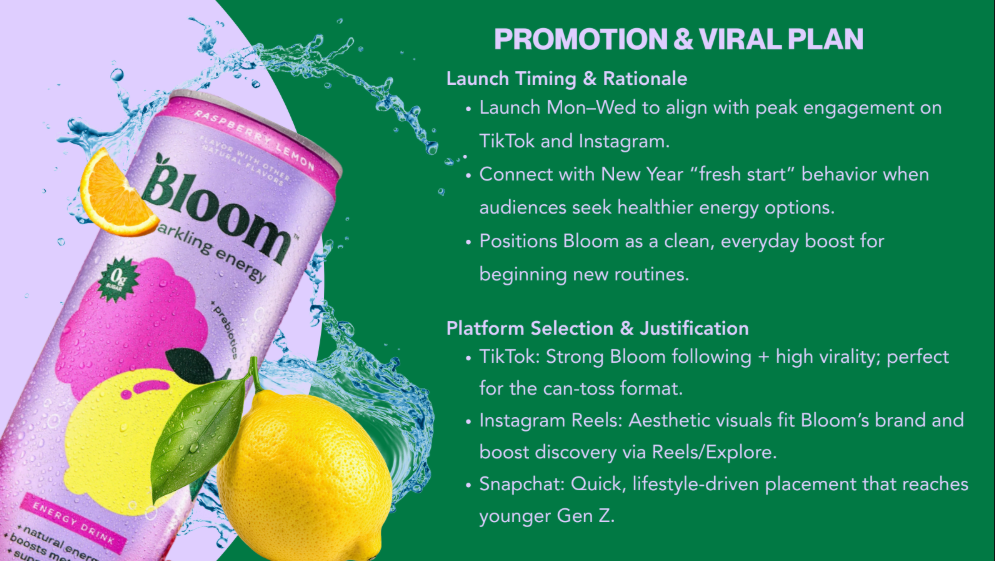
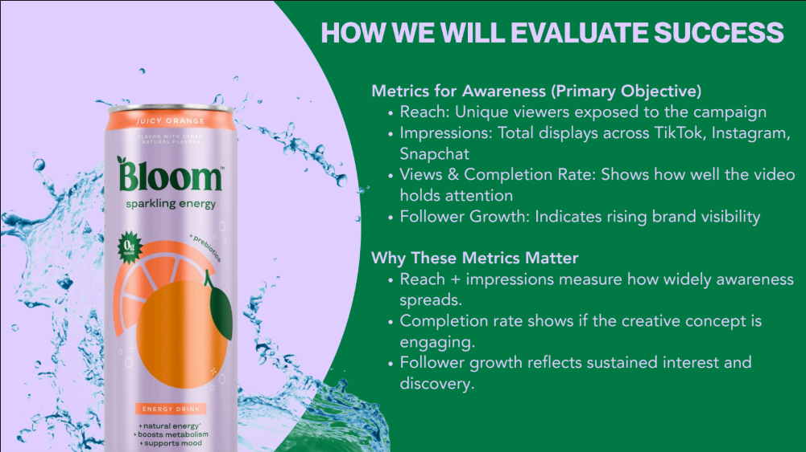

# 🌿 Bloom Video Campaign — Social Media Campaign Strategy

*Video Campaign | Content Strategy | TikTok | Instagram | Gen Z Marketing | UGC*

Collaborated with a six-person team to develop a full social media video campaign for Bloom Nutrition's Sparkling Energy drink line. Conducted a cross-platform social media audit identifying gaps in Instagram engagement and opportunities on TikTok and Snapchat. Conceptualized and produced a personality-driven can-toss video series built around the "Bloom helps me ___" format, featuring real-life use cases across fitness, dance, photography, and commuter settings. Designed a viral promotion plan targeting Gen Z and young Millennials with influencer tie-ins, UGC challenges, and a Mon–Wed launch cadence aligned with peak platform engagement. Defined success metrics including reach, impressions, completion rate, and follower growth benchmarked against Celsius and Alani Nu.

---

## 📌 Key Highlights

- Conducted a full cross-platform social media audit identifying that strong TikTok presence was not translating to Instagram engagement, with Facebook and X accounts inactive
- Identified that many consumers recognized Bloom as a supplement brand but were unaware of the Sparkling Energy drink line, with Alani Nu and Celsius dominating the "health-forward energy" category
- Conceptualized the "Bloom helps me ___" can-toss video series featuring real-life use cases across fitness, dance, photography, and commuter settings
- Designed a Mon–Wed launch cadence to align with peak TikTok and Instagram engagement windows, tied to New Year "fresh start" consumer behavior
- Platform strategy covered TikTok (virality + can-toss format), Instagram Reels (aesthetic discovery), and Snapchat (younger Gen Z reach)
- Success metrics defined across reach, impressions, views and completion rate, and follower growth — benchmarked against Celsius and Alani Nu

---

## 📄 Full Presentation

[Download Full Presentation (PDF)](https://drive.google.com/file/d/1E3iBLDrlp-cE1NczonlfRw7s9fZ2V_Pd/view)

---

## 🖼️ Project Screenshots

---

## 👥 Contributors

- **Britnee Bayas** — Group 3
